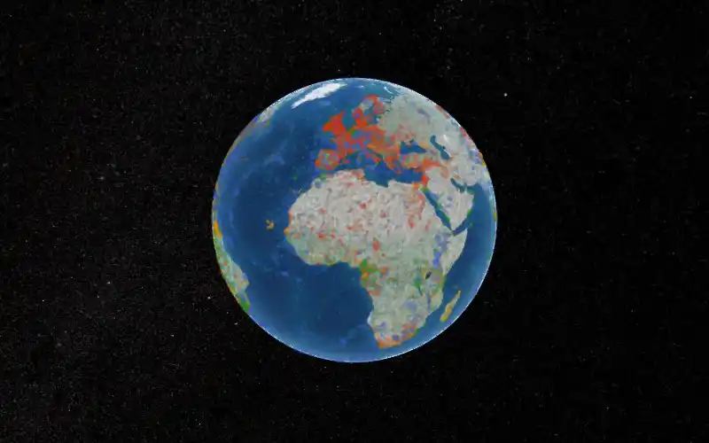
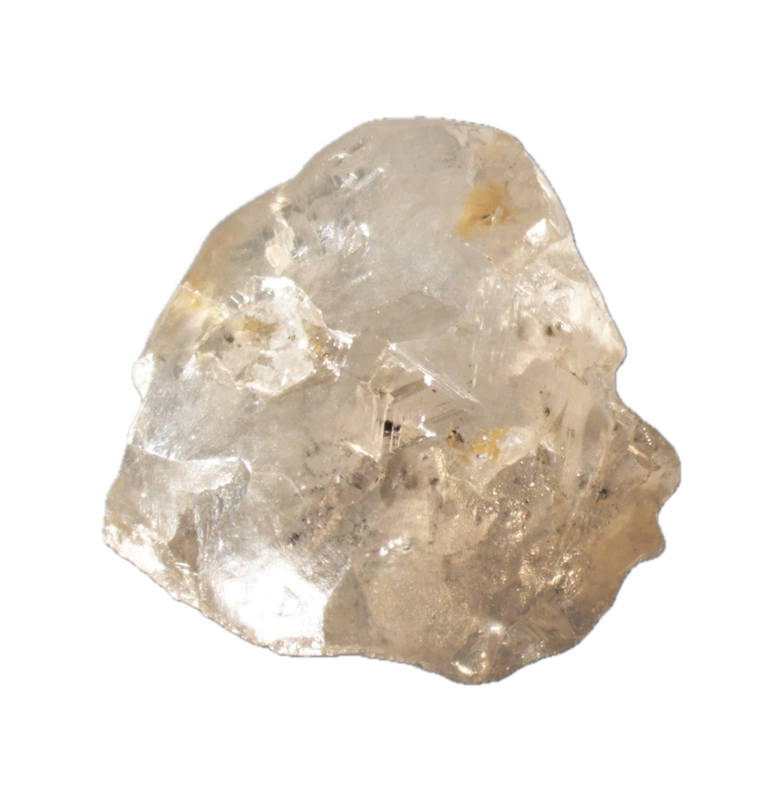
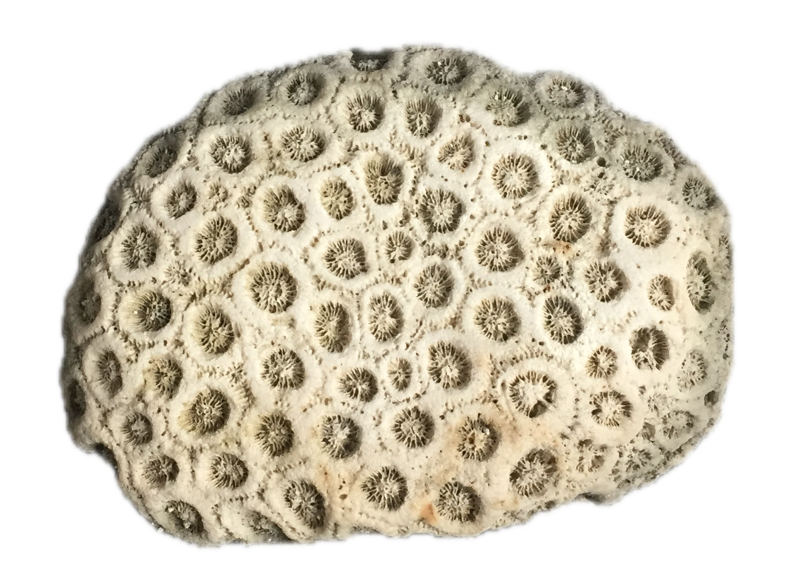
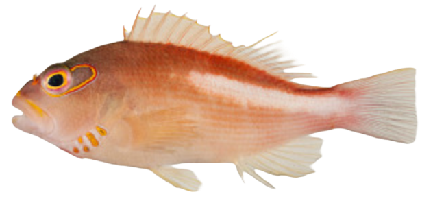
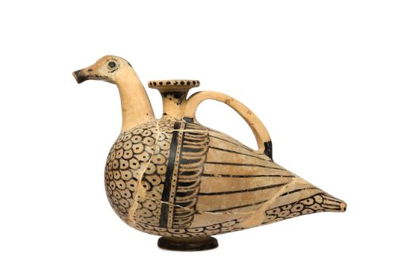

::: {.column-page}

[{fig-alt="Animated rotating globe showing iSamples data points from 4 scientific repositories" width="100%" .nolightbox}](/explorer.html "Explore the interactive globe")

:::

::: {.callout-note appearance="minimal"}
**6.7 million** physical samples | **4** repositories (SESAR, OpenContext, GEOME, Smithsonian) | **90+** countries | **Zero installation** — runs in your browser
:::

## Showcase: Real Samples from the Collection {.unnumbered}

::: {layout-ncol=4 layout-valign="center"}

[{group="showcase" fig-alt="Mineral sample from the Mirny diamond mine"}](https://n2t.net/IGSN:DIA000004 "Mineral sample, Mirny diamond mine, Russia — collected 2014-03-07")

[{group="showcase" fig-alt="Rock/mineral sample"}](https://n2t.net/IGSN:IEGIL000C "Rock/mineral sample \"18LCI-5\" — collected 2018-06-13")

[{group="showcase" fig-alt="Fish specimen"}](https://n2t.net/ark:/21547/CXs2MParis0001 "Paracirrhites arcatus, French Polynesia — collected 2006-03-10")

[{group="showcase" fig-alt="Archaeological object from Murlo, Italy"}](https://n2t.net/ark:/28722/r2p24/vdm_19600211 "Archaeological object \"VdM 19600211,\" Vescovado di Murlo, Italy")

:::

*Photos above are curator-selected illustrations, not photographs of the specific specimens (source repositories don't yet supply images for most samples) — but every sample below the image now links to its real, citable record in the collection. Click through to confirm.*

::: {.callout-tip collapse="true"}
## What is iSamples?

The Internet of Samples (iSamples) is a multi-disciplinary and multi-institutional project funded by the **National Science Foundation** to design, develop, and promote service infrastructure to uniquely, consistently, and conveniently identify material samples, record metadata about them, and persistently link them to other samples and derived digital content, including images, data, and publications.

iSamples integrates data from four major scientific repositories:

- **[SESAR](https://www.geosamples.org/)** — Earth science samples (rocks, minerals, sediments, soils)
- **[OpenContext](https://opencontext.org/)** — Archaeological and cultural heritage materials
- **[GEOME](https://geome-db.org/)** — Genomic and biological specimens
- **[Smithsonian](https://collections.nmnh.si.edu/)** — Natural history museum collections
:::

::: {.callout-tip collapse="true"}
## How can I access it?

The project uses **geoparquet files + DuckDB-WASM** for efficient, browser-based data access and analysis — no server required.

- **iSamples Full Dataset**: ~280 MB wide format, 6.7M samples
- **Available via**: Cloudflare R2 with HTTP range requests
- **Interactive tools**: [Interactive Explorer](/explorer.html) — search, filter, and explore 6.7M samples on a 3D globe or in a paginated table

All analysis happens in your browser. Only the data you need is downloaded — typically less than 1 MB for initial exploration.
:::

::: {.callout-tip collapse="true"}
## Why browser-based?

- **Universal access** — No installation, works in any modern browser
- **Fast analysis** — 5-10x faster than downloading full datasets
- **Memory efficient** — Analyze 300MB datasets using less than 100MB browser memory
- **Minimal transfer** — Only download the columns and rows you need
- **Reproducible** — Share a URL and anyone can see exactly what you see
:::

---

 

# iSamples in Action {.unnumbered}

::: {.column-page style="display: flex; flex-direction: column; align-items: center; justify-content: center; text-align: center; width: 100%;"}

<video autoplay muted playsinline controls style="max-width: 100%; display: block;" aria-label="iSamples data visualization from Moorea">
<source src="assets/mdvunmuted.mp4" type="video/mp4"/>
Your browser does not support the video tag.
</video>

  Data visualization from the island of Moorea in French Polynesia.

:::
