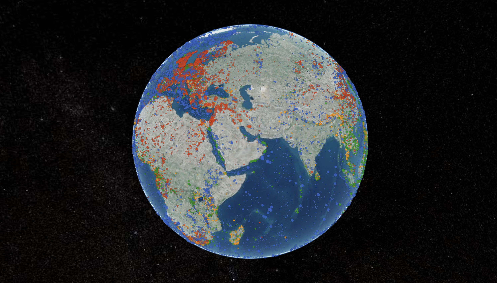
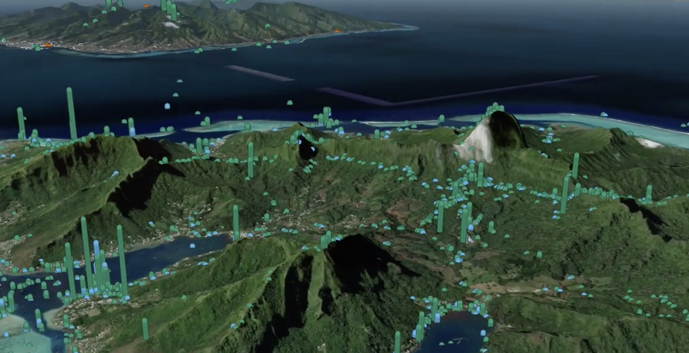

[{group="my-group"}](/explorer.html "interact with iSamples data (still a bit slow to load)")

::: {layout-ncol=4 layout-valign="center"}

[{width="7%"
group="my-group"}](https://n2t.net/IGSN:DIA000004 "Mineral sample, Mirny diamond mine, Russia — collected 2014-03-07")

[{width="7%" group="my-group"}](https://n2t.net/IGSN:IEGIL000C "Rock/mineral sample \"18LCI-5\" — collected 2018-06-13")

[{width="10%" group="my-group"}](https://n2t.net/ark:/21547/CXs2MParis0001 "Paracirrhites arcatus, French Polynesia — collected 2006-03-10")

[{width="10%"
group="my-group"}](https://n2t.net/ark:/28722/r2p24/vdm_19600211 "Archaeological object \"VdM 19600211,\" Vescovado di Murlo, Italy — real photo, via OpenContext")

:::

The Internet of Samples (iSamples) is a multi-disciplinary and multi-institutional project funded by the National Science Foundation to design, develop, and promote service infrastructure to uniquely, consistently, and conveniently identify material samples, record metadata about them, and persistently link them to other samples and derived digital content, including images, data, and publications.

[{width="100%" group="my-group"}](https://youtu.be/JzNadmklzNs "iSamples data visualization")

